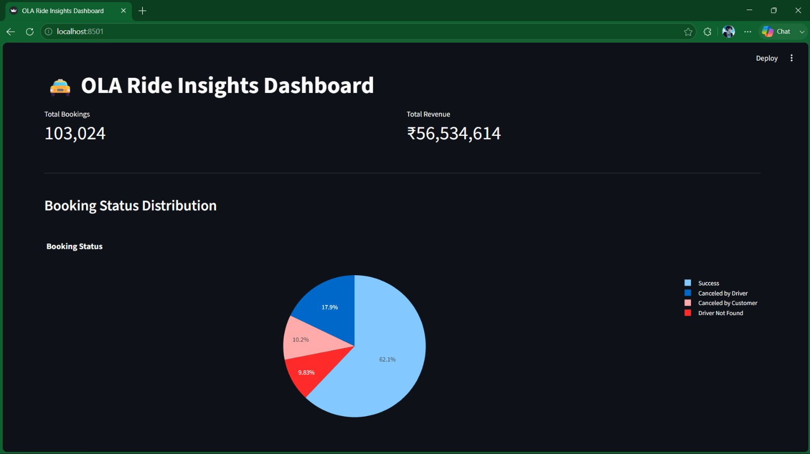
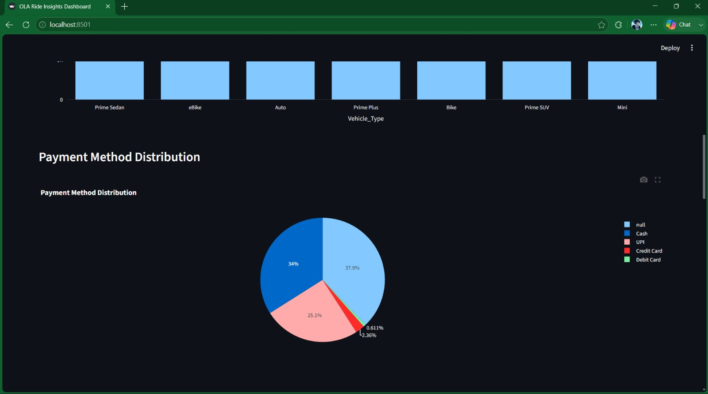
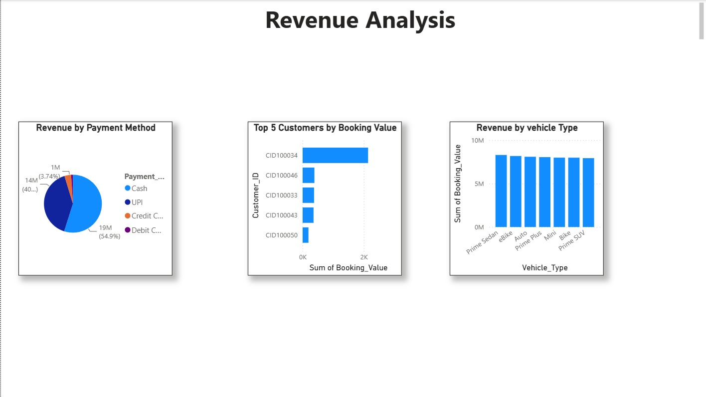
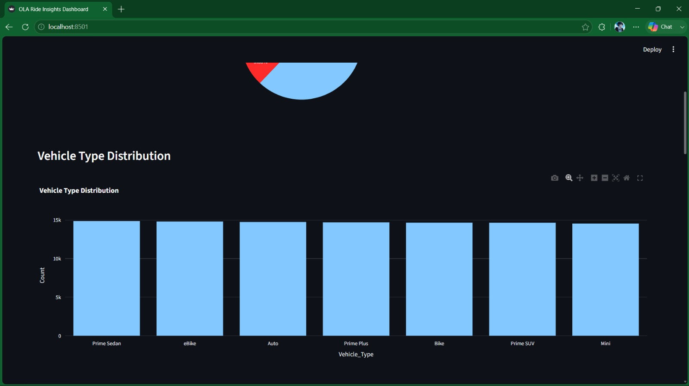
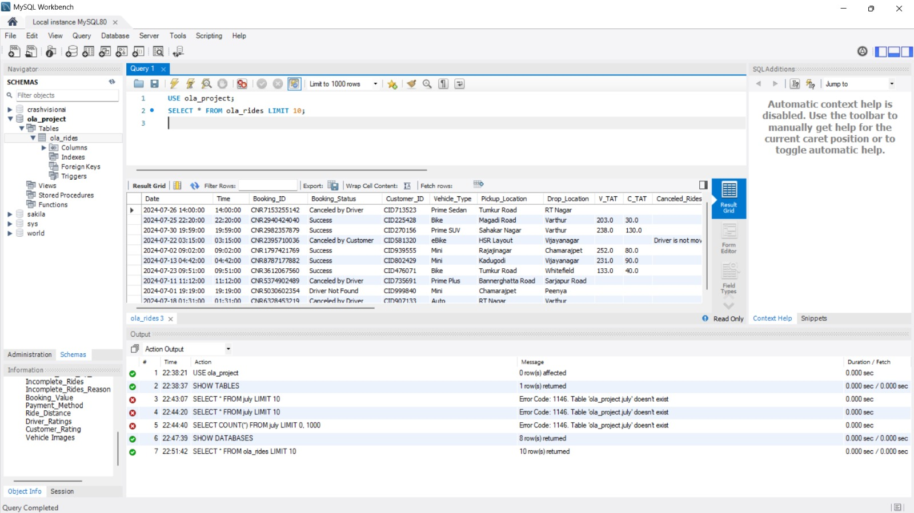
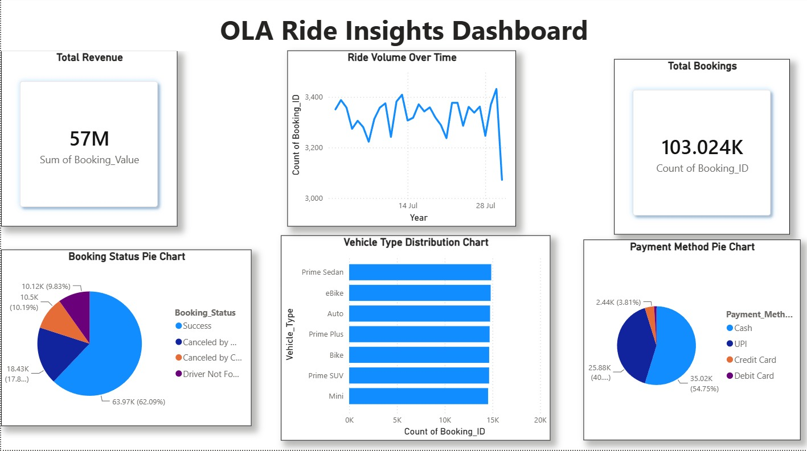
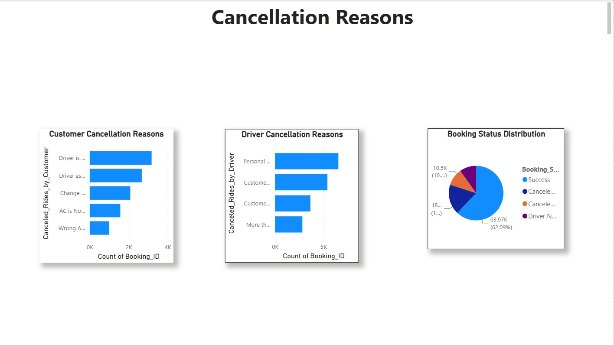

# 🚖📊 Ola Ride Analytics Dashboard

A comprehensive Data Analytics and Business Intelligence project designed to analyze ride-booking data, uncover customer behavior patterns, monitor operational performance, and generate actionable insights using Python, Power BI, and Data Visualization techniques.

The project transforms raw ride-sharing data into meaningful business intelligence through interactive dashboards, trend analysis, and performance monitoring.

## 🚀 Project Overview

The **Ola Ride Analytics Dashboard** helps analyze ride-booking operations by providing insights into bookings, cancellations, revenue generation, ride distances, customer ratings, and driver performance.

The project combines:

- Data Cleaning & Preprocessing
- Exploratory Data Analysis (EDA)
- Business Intelligence Reporting
- Interactive Dashboards
- Data Visualization
- KPI Monitoring

## ✨ Key Features

### 📊 Ride Booking Analysis

- Total Bookings Overview
- Successful Ride Analysis
- Cancelled Ride Tracking
- Ride Completion Rate

### 💰 Revenue Analytics

- Total Revenue Generated
- Booking Value Analysis
- Revenue Trends
- Payment Method Distribution

### 🚖 Operational Insights

- Vehicle Type Analysis
- Ride Distance Monitoring
- Pickup & Drop Location Analysis
- Driver Performance Tracking

### ⭐ Customer Experience Analysis

- Customer Rating Analysis
- Driver Rating Insights
- Service Quality Monitoring
- Customer Satisfaction Trends

### 📈 Interactive Dashboard

- Dynamic Filters
- KPI Cards
- Interactive Charts
- Trend Exploration

## 📊 Dashboard Insights

The dashboard provides:

- Booking Status Analysis
- Revenue Breakdown
- Ride Cancellation Trends
- Driver Performance Metrics
- Customer Satisfaction Analysis
- Vehicle Category Comparison
- Distance Distribution Analysis
- Payment Method Analysis
- Location-Based Insights

## 🛠️ Technology Stack

### Data Analytics

- Python
- Pandas
- NumPy

### Data Visualization

- Matplotlib
- Power BI

### Development Tools

- Jupyter Notebook
- VS Code

### Dataset Formats

- CSV
- Excel (XLSX)

## 📈 Exploratory Data Analysis (EDA)

The project performs:

- Data Cleaning
- Missing Value Handling
- Duplicate Removal
- Statistical Analysis
- Trend Analysis
- Revenue Analysis
- Customer Behavior Analysis
- Driver Performance Evaluation

## 📊 Key Performance Indicators (KPIs)

- Total Bookings
- Successful Rides
- Cancelled Rides
- Total Revenue
- Average Booking Value
- Average Ride Distance
- Customer Ratings
- Driver Ratings

## 📸 Output Screenshots

### 🚖 Ola Analytics Dashboard

### 📊 Analytics Overview

### 📈 Revenue Analysis

### 📉 Charts & Visualizations

### 🗂️ Dataset Overview

### 💡 Business Insights

### 🔍 Cancellation Reasons Analysis

## 🎯 Project Objectives

- Analyze ride-sharing business performance
- Monitor booking and cancellation trends
- Identify revenue-generating opportunities
- Improve customer experience insights
- Support data-driven business decisions
- Create interactive business dashboards

## 📚 Skills Gained

- Data Analytics
- Business Intelligence
- Data Visualization
- Exploratory Data Analysis
- Dashboard Development
- KPI Analysis
- Power BI Reporting
- Python Programming

## 👨‍💻 Author

**Logamithran**

Passionate about Data Analytics, Business Intelligence, Machine Learning, Dashboard Development, and Data Visualization.

## ⭐ Support

If you found this project useful, consider giving it a **Star ⭐** on GitHub!

🚖 Turning Ride Data into Business Intelligence 📊
